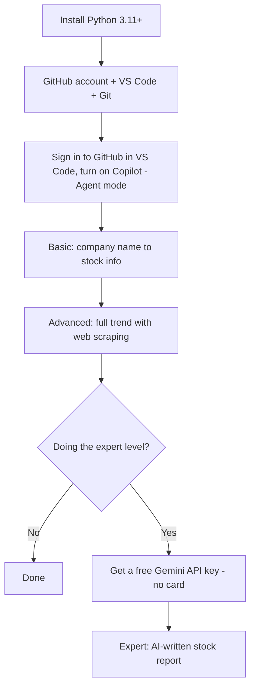

# 00 — Prerequisites

Set this up **before** the workshop. Doing it live eats into lab time, so arrive with
the checklist below ticked.

## Bring your laptop ready — one-page checklist

Do this **at home, 2–3 days before** the workshop. College Wi-Fi is slow when 60
laptops download at once, and some steps (GitHub Education approval) take days.

**Your laptop**

- [ ] **Windows 10 or 11 (64-bit)** recommended. UiPath Studio (Project 3) runs only on
      Windows; Projects 1 and 2 also work on macOS or Linux.
- [ ] At least **8 GB RAM** and **10 GB free disk space**.
- [ ] You can **install software** (administrator rights). College-managed laptops often
      block this: check early.
- [ ] **Charger** packed (it's a 5-hour session) and the laptop fully updated.
- [ ] A **phone** with you: for sign-in codes, and as a **mobile hotspot** if the lab
      network blocks something.

**Accounts (all free, no credit card)**

- [ ] **GitHub** account, and apply for **GitHub Education** (Copilot Student) with your
      college email or ID card. Approval can take 1–3 days.
- [ ] **Google** account, for the free Gemini API key (Project 1 expert).
- [ ] **UiPath Automation Cloud (Community)** account (Project 3).
- [ ] *(Optional)* **Groq** account as a backup AI key.

**Installed and working**

- [ ] **Python 3.11+**, with "Add python.exe to PATH" ticked — [`python-setup.md`](python-setup.md)
- [ ] **VS Code** + the **Python** extension, **Git**, VS Code **signed in to GitHub**, **Copilot
      Chat in Agent mode** — [`git-and-editor.md`](git-and-editor.md)
- [ ] **UiPath Studio** (desktop) installed and signed in to your Community account
      (Project 3) — [`uipath-cloud.md`](uipath-cloud.md)
- [ ] The **workshop repo** on your laptop (see below)
- [ ] The **Python packages** installed: `pip install -r 00-prerequisites/requirements.txt`
- [ ] A **`.env`** file with your **Gemini key** (Project 1 expert) — [`free-ai-api-key.md`](free-ai-api-key.md)

**Get the workshop repo:** in VS Code, **View → Command Palette → Git: Clone**, paste
`https://github.com/PrajwalAIProject/rpa-ai-workshop.git`, choose a folder, and open it.
Or, in a terminal:

```bash
git clone https://github.com/PrajwalAIProject/rpa-ai-workshop.git
```

(No Git yet? On the GitHub page click **Code → Download ZIP** and unzip it.)

**The night before — 5-minute test.** Open the repo folder in VS Code, open a terminal
(**Terminal → New Terminal**), and run:

```bash
python --version
git --version
python 01-stock-market-analyzer/basic/company_info.py "Infosys"
python 01-stock-market-analyzer/expert/ai_stock_report.py "Infosys" --dry-run
```

You should see Python 3.11+, a Git version, an Infosys stock block, and a printed AI
prompt. Then, in Copilot Chat (Agent mode), ask it to *"create hello.py that prints
Copilot works, then run it"*. If all five work, your laptop is ready. If not, check the
guide for that step or ask your instructor **before** the day.

---

This folder is an index. Each setup task has its own short guide:

- [`python-setup.md`](python-setup.md) — Python 3.11+ (and an optional virtual environment)
- [`git-and-editor.md`](git-and-editor.md) — **GitHub account, VS Code, Git and GitHub Copilot** (the AI that writes the Project 1 code with you)
- [`free-ai-api-key.md`](free-ai-api-key.md) — a **free** Gemini (or Groq) API key for the Project 1 expert AI report, with no card needed
- [`uipath-cloud.md`](uipath-cloud.md) — UiPath Automation Cloud (Community), Project 3
- [`api-keys.md`](api-keys.md) — Anthropic API key, Project 2 expert
- [`kiro-install.md`](kiro-install.md) and [`aws-free-tier.md`](aws-free-tier.md) — Project 3 expert only (optional)

> **Heads-up:** GitHub, Google and Groq change their plans and screens often. Every
> fact below was checked in October 2026; **confirm current details on the official
> pages linked in each guide before the session.**

---

## Project 1 in one picture

_Project 1 (stock market analyzer) needs Python, VS Code and a GitHub account with
Copilot. The expert level adds one free AI API key._



---

## Checklist

**Everyone:**

- [ ] **Python 3.11 or newer** installed and on your PATH: `python --version` works.
      See [`python-setup.md`](python-setup.md).
- [ ] A **GitHub account**. Students: also apply for **GitHub Education** (Copilot
      Student). It can take 1–3 days. See [`git-and-editor.md`](git-and-editor.md).
- [ ] **VS Code** and **Git** installed, VS Code **signed in to GitHub**, and
      **Copilot Chat** working in **Agent** mode (the `hello.py` test in
      [`git-and-editor.md`](git-and-editor.md) passes).
- [ ] An empty project folder, e.g. `C:\stock-project`, opened in VS Code.

**Project 1 expert (AI report):**

- [ ] A free **Gemini API key** (or Groq) in a `.env` file in your project folder. See
      [`free-ai-api-key.md`](free-ai-api-key.md).

**Project 2 expert:** an Anthropic API key, see [`api-keys.md`](api-keys.md).

**Project 3:** a free **UiPath Automation Cloud (Community)** account, see
[`uipath-cloud.md`](uipath-cloud.md).

---

## Which tool does each project need?

| Project / level | Python | VS Code + GitHub Copilot | Free AI key (Gemini/Groq) | UiPath Cloud | Anthropic key |
| --------------- | :----: | :----------------------: | :-----------------------: | :----------: | :-----------: |
| **1** Stock — basic | ✅ | ✅ | — | — | — |
| **1** Stock — advanced (web scraping) | ✅ | ✅ | — | — | — |
| **1** Stock — expert (AI report) | ✅ | ✅ | ✅ | — | — |
| **2** News — basic / advanced | ✅ | ✅ | — | — | — |
| **2** News — expert | ✅ | ✅ | — | — | ✅ |
| **3** RPA — basic / advanced | ✅ | — | — | ✅ | — |
| **3** RPA — expert (agentic) | ✅ | — | — | ✅ | — |

**No AWS account and no credit card are needed for Project 1.**

**Python packages:** in Project 1, Copilot installs what each script needs (it runs
`pip install ...` and asks you first). To install everything up front instead, run
`pip install -r 00-prerequisites/requirements.txt`; see [`python-setup.md`](python-setup.md).

---

## Order to do it in

1. [Python](python-setup.md)
2. [GitHub account → VS Code → Git → Copilot](git-and-editor.md) (apply for GitHub Education early)
3. [Free AI API key](free-ai-api-key.md), for the Project 1 expert level
4. [UiPath Cloud](uipath-cloud.md) (Project 3), [Anthropic key](api-keys.md) (Project 2 expert)

Secrets (the Gemini/Groq key, the Anthropic key, SMTP passwords) go **only** in a local
`.env` file, which is git-ignored. Copy [`.env.example`](../.env.example) to `.env` and
fill in your own values. **Never commit real keys and never paste them into Copilot Chat.**
