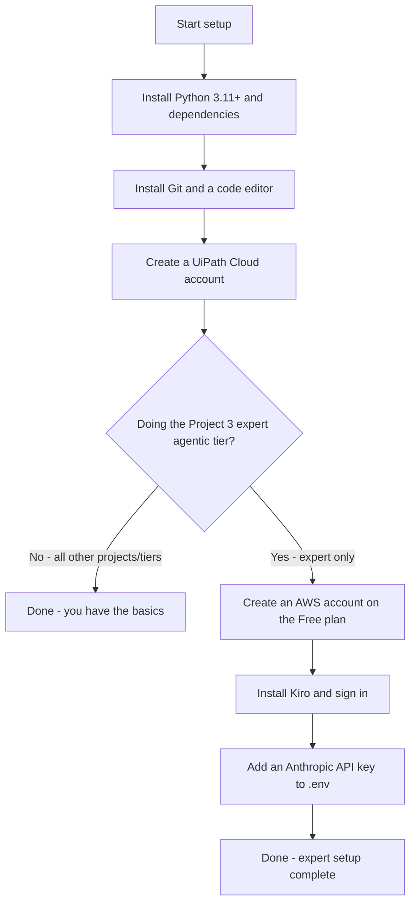

# 00 — Prerequisites

Set this up **before** the 5-hour workshop. Everything else in the repo assumes it is
done. Doing it live eats into lab time, so arrive with the checklist below ticked.

This folder is an index. Each major setup task has its own focused guide — follow the
ones your tier needs:

- [`python-setup.md`](python-setup.md) — Python 3.11+, virtual environment, dependencies
- [`git-and-editor.md`](git-and-editor.md) — Git and a code editor (VS Code / Kiro)
- [`uipath-cloud.md`](uipath-cloud.md) — UiPath Automation Cloud (Community) for Project 3
- [`aws-free-tier.md`](aws-free-tier.md) — AWS account + cost safety (expert tier only)
- [`kiro-install.md`](kiro-install.md) — Install Kiro (expert tier only)
- [`api-keys.md`](api-keys.md) — Anthropic API key for the expert AI tiers

> **Heads-up:** AWS and Kiro change their terms, pricing, and screens often. Every fact
> below was accurate at the time of writing, but **confirm current details on the
> official pages linked in each guide before the session.** Content was rephrased for
> compliance with licensing restrictions.

---

## What to install — decision tree

_Everyone sets up the first four tools; only the Project 3 expert tier adds AWS, Kiro,
and an Anthropic key._

> **Note:** the expert AI steps in Projects 1 and 2 also need the **Anthropic API key**,
> but not AWS or Kiro. Use the tool matrix below to confirm exactly what your tier needs.

---

## What you need before the session — checklist

Tick each item once it's actually done. The first group is for **everyone**; the rest
depends on how far you take each project.

**Everyone (all projects, basic tier):**

- [ ] Python **3.11 or newer** installed and on your PATH — see [`python-setup.md`](python-setup.md)
- [ ] A **virtual environment** created and dependencies installed from
      [`requirements.txt`](requirements.txt) — see [`python-setup.md`](python-setup.md)
- [ ] **Git** installed and configured — see [`git-and-editor.md`](git-and-editor.md)
- [ ] A **code editor** (VS Code recommended) — see [`git-and-editor.md`](git-and-editor.md)

**Project 3 (basic / advanced tiers):**

- [ ] A free **UiPath Automation Cloud (Community)** account with MFA on —
      see [`uipath-cloud.md`](uipath-cloud.md)

**Expert tiers (Project 1 & 2 AI steps, Project 3 agentic layer):**

- [ ] An **Anthropic API key** in a local `.env` file — see [`api-keys.md`](api-keys.md)
- [ ] An **AWS account** on the **Free account plan**, with MFA + a budget alert —
      see [`aws-free-tier.md`](aws-free-tier.md)  *(Project 3 expert)*
- [ ] **Kiro** installed and signed in — see [`kiro-install.md`](kiro-install.md)
      *(Project 3 expert)*

---

## Which tool does each project need?

| Project / tier | Python + deps | Git + editor | UiPath Cloud | Anthropic key | AWS | Kiro |
| -------------- | :-----------: | :----------: | :----------: | :-----------: | :-: | :--: |
| **1** Stock — basic / advanced | ✅ | ✅ | — | — | — | — |
| **1** Stock — expert (AI + Actions) | ✅ | ✅ | — | ✅ | — | — |
| **2** News — basic / advanced | ✅ | ✅ | — | — | — | — |
| **2** News — expert (AI + email) | ✅ | ✅ | — | ✅ | — | — |
| **3** RPA — basic / advanced | ✅ | ✅ | ✅ | — | — | — |
| **3** RPA — expert (agentic) | ✅ | ✅ | ✅ | — | ✅ | ✅ |

The Project 3 **expert** watcher itself needs no network and no API key — the AWS +
Kiro requirement is for authoring the agent spec in Kiro, not for running the sample.

---

## Order to do it in

1. [Python](python-setup.md) → [Git + editor](git-and-editor.md) — needed by every project.
2. [UiPath Automation Cloud](uipath-cloud.md) — if you're doing Project 3.
3. [Anthropic API key](api-keys.md) — if you're doing any expert AI tier.
4. [AWS Free Tier](aws-free-tier.md) → [Kiro](kiro-install.md) — only for Project 3 expert.

Secrets (the Anthropic key, SMTP passwords, webhooks) go **only** in a local `.env`
file, which is git-ignored. Copy [`.env.example`](../.env.example) to `.env` and fill in
your own values. **Never commit real keys.**
