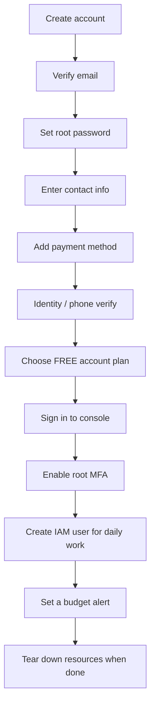

# AWS account + cost safety (optional, not needed for any level)

**No level of this workshop needs AWS.** Kiro works without an AWS account. This guide is
only for students who want, on their own, to host the Project 3 watcher in the cloud.
This is the longest guide because getting it right is how you **avoid any charges**.

> **Read this before you click anything.** AWS changed its free offering on
> **15 July 2025**. The facts below reflect the current model. AWS updates its terms and
> screens often — **confirm the current details on the official pages linked here before
> the session.** Facts here are attributed to AWS's official billing/account
> documentation. Content was rephrased for compliance with licensing restrictions.

## What you'll set up

- A new **AWS account** on the **Free account plan** (the safe choice for this workshop).
- **MFA** on the root user.
- An **IAM user** for daily work instead of the root user.
- A **budget alert** so you're notified long before any spend.

---

## How the current AWS free model works (post–15 July 2025)

- Every **new** AWS account chooses between a **Free account plan** and a **Paid account
  plan** at signup. The old "12-month free trial" model only applies to accounts created
  **before** July 2025.
- New accounts get **USD $100 in credits on sign-up**, and can **earn up to another
  $100** (so **$200 total**) by completing onboarding activities with services such as
  EC2, RDS, Lambda, Bedrock, and AWS Budgets.

### Free account plan (recommended for students)

- You will **not incur charges** on this plan.
- It **ends** after **six months**, or when your credits are fully used — **whichever
  comes first**.
- When it ends, the account **closes automatically** and you lose access to your
  resources. AWS **keeps your content for 90 days**, during which you can upgrade to Paid
  to keep everything.
- The Free plan **excludes** services that could drain credits (for example Savings
  Plans, Reserved Instances, and some AWS Marketplace offers).
- The Free plan **auto-upgrades to Paid** if you do certain things, including: joining
  **AWS Organizations**, setting up a **Control Tower** landing zone, joining the **AWS
  Partner Network**, signing a **Professional Services** contract or **Enterprise
  Agreement**, buying a **Skill Builder Team** subscription, or marking the account as
  **HIPAA/SEC** compliant. Avoid all of these during the workshop.

### Paid account plan

- **Pay-as-you-go** for any usage beyond your credit balance.
- The account does **not** close when credits run out — it just starts billing you.

**For this workshop, choose the Free account plan.** It's the safest way to avoid
charges. Note that signup still requires a **payment method (card) on file** in most
regions even for the Free plan, and that AWS has charged for **public IPv4 addresses
since February 2024** — so don't leave EC2 instances with public IPs running.

Sources: [AWS Free Tier](https://aws.amazon.com/free/) and
[AWS Billing & Cost Management docs](https://docs.aws.amazon.com/awsaccountbilling/latest/aboutv2/billing-what-is.html).

---

## Card-free options for students (often better than the standard Free Tier)

If you want to learn AWS **without ever entering a card**, two programs are a better fit
for a classroom than the standard Free account plan. Content was rephrased for
compliance with licensing restrictions.

### AWS Student Rewards (no card, best for card-free learning)

- Launched around **20 August 2026** through the **AWS Builder Center** — **no credit
  card is ever required**.
- Gives you roughly **12 months of premium Skill Builder training**, **up to $30 in AWS
  credits**, and a **$100 certification exam voucher**.
- This is the best card-free path for students who mainly want to learn and earn credits.

Sources:
[Free AWS certification for students — step-by-step guide](https://dev.to/aws-builders/free-aws-certification-for-students-the-complete-step-by-step-guide-3m1m)
and [AWS Builder Center — Student Rewards](https://builder.aws.com/student-rewards).

### AWS Educate (email-only, no card, learners 13+)

- Register with **just an email address** — **no credit card** needed.
- Open to learners **13 and older**, aimed at **pre-professional / new-to-cloud**
  learners who want hands-on practice.

Source: [AWS Educate](https://aws.amazon.com/education/awseducate/).

### Which path should a class pick?

For a classroom, **prefer a card-free path** (AWS Student Rewards or AWS Educate) unless
the exercise specifically needs **full console / EC2 access**, in which case use the
standard **Free account plan** with the cost-safety steps already documented below.

---

## The whole flow at a glance

_The signup steps come first, then the cost-safety steps that keep the account free._

---

## Steps — create the account

1. Go to [aws.amazon.com](https://aws.amazon.com/) and click **Create an AWS Account**
   (top right).

   
    Screenshot needed — see <a href="images/README.md">images/README.md</a>. Capture: the AWS homepage with the top-right "Create an AWS Account" button in view.
2. Enter your **email address** and an **account name**, then verify your email with the
   code AWS sends.
3. Set a **root user password**.
4. Enter your **contact information** and choose **Personal** account type.
5. Enter a **payment method (card)**. AWS may place a **small temporary verification
   hold** that is refunded. (Required in most regions even for the Free plan.)
6. Complete **identity / phone verification** (SMS or call with a code).
7. When asked to choose a plan, select the **Free account plan**.
8. Finish, then **sign in to the console** as the root user.

   
    Screenshot needed — see <a href="images/README.md">images/README.md</a>. Capture: the plan-selection step with the Free account plan selected.

---

## Cost safety — avoiding mandatory charges

Do these **right after** your first sign-in. They take about ten minutes and are what
keep the account free.

### 1. Enable MFA on the root user

1. In the console, open the account menu (top right) → **Security credentials**.
2. Under **Multi-factor authentication (MFA)**, choose **Assign MFA device**.
3. Use an authenticator app (e.g. Google Authenticator, Authy) and scan the QR code.

> The root user can do anything, including spending money. Protect it first.

### 2. Create an IAM user for daily work

Don't use root for day-to-day tasks.

1. Open the **IAM** console → **Users** → **Create user**.
2. Give it a name, grant **console access**, and attach a sensible policy (your
   instructor will specify; `PowerUserAccess` or a scoped policy is typical for a lab).
3. Sign out of root and sign in as the IAM user for the exercises.

(Alternatively use **IAM Identity Center** if your instructor prefers it.)

### 3. Set up a budget alert

A budget emails you before anything unexpected happens.

1. Open **AWS Budgets** (Billing and Cost Management console → **Budgets**).
2. Click **Create budget**. AWS offers a ready-made **"Zero spend budget"** template —
   that's the simplest choice. Otherwise choose **Cost budget** and set a low amount
   like **$1** or **$5**.

> **AWS Budgets is free for one monthly budget.** AWS gives you **62 budget-days per
> month free**, so a single monthly cost budget costs nothing to run — perfect for this
> alert. Other always-free examples include **AWS Lambda (~1M requests/month)** and
> **CloudWatch (~10 alarms)**. Content was rephrased for compliance with licensing
> restrictions. Sources:
> [Control your costs with Free Tier budgets](https://aws.amazon.com/getting-started/hands-on/control-your-costs-free-tier-budgets/),
> [Free Tier plans](https://docs.aws.amazon.com/awsaccountbilling/latest/aboutv2/free-tier-plans.html),
> and [Checklist for unwanted charges](https://docs.aws.amazon.com/awsaccountbilling/latest/aboutv2/checklistforunwantedcharges.html).

   
    Screenshot needed — see <a href="images/README.md">images/README.md</a>. Capture: the AWS Budgets "Create budget" screen with the Zero spend budget template chosen.
3. Add **email alert thresholds** at **50%**, **80%**, and **100%** of the amount.
4. Enter the email to notify, and finish.

### 4. Turn on billing visibility and watch your credits

1. In **Billing and Cost Management**, enable **billing alerts** / cost monitoring.
2. Check the **credit balance** there periodically so you know how much of your $100–$200
   remains.

### 5. Stop and terminate what you spin up

For EC2 (if the expert exercise uses a VM):

- **Stop** = the instance is powered off but still exists; its storage (EBS) may still
  cost a little, and a reserved public IP can still bill. Good for a short pause.
- **Terminate** = the instance is deleted permanently. Use this when you're done.
- **Release Elastic IPs** you allocated, and **delete** any volumes, snapshots, or
  other resources you created.

### End-of-session teardown checklist

- [ ] **Terminate** any EC2 instances you launched.
- [ ] **Release** any Elastic/public IPv4 addresses you allocated.
- [ ] **Delete** any EBS volumes, snapshots, S3 buckets, or other resources you created.
- [ ] Check **Billing and Cost Management** shows no new ongoing charges.

### Why you won't be force-charged (and the real risks)

On the **Free account plan**, usage is capped to your credits / always-free limits, so
you **cannot** be billed while you stay on it. The real risks are:

- **Accidentally upgrading to Paid** — avoid the auto-upgrade triggers listed above
  (Organizations, Control Tower, Partner Network, etc.).
- **Leaving public-IPv4 resources running** if you've moved to the Paid plan.

Stay on Free, keep the budget alert on, don't launch non-free services, release public
IPv4 addresses, and tear down resources after the exercise. That combination keeps the
account at zero cost.

### Closing the account afterward

If you never want to use AWS again after the workshop:

1. Open the **Account** settings page (account menu → **Account**).
2. Scroll to **Close Account**, read the warnings, and confirm.
3. AWS **retains your data for 90 days** after closure, during which you could still
   reopen; after that it's gone.

---

## Verify

1. You can sign in to the AWS console on the **Free account plan**.
2. **MFA** is active on the root user.
3. An **IAM user** exists and you can sign in as it.
4. A **budget** with email alerts is active in AWS Budgets.

---

## Common errors and fixes

- **Card declined / verification hold** — Use a card that supports international online
  payments; the small hold is temporary and refunded. International students sometimes
  need a card that works for USD.
- **Phone/identity verification fails** — Retry the SMS vs. voice option, and make sure
  the country code is correct.
- **"I don't want to add a card"** — A card is required for signup in most regions even
  on the Free plan. In a classroom, your instructor may run the AWS/Kiro portion from a
  shared account instead.
- **Account closed unexpectedly** — The Free plan ends at six months or when credits run
  out, and then closes automatically. You have a 90-day window to upgrade to Paid if you
  need the resources back.
