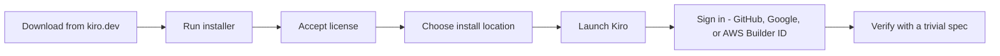

# Install Kiro (Project 3 expert only)

The Project 3 expert tier uses **Kiro** to describe the watcher agent as a spec in plain
English. You only need this for that tier.

> AWS and Kiro update their terms, pricing, and screens often. The facts below were
> accurate at the time of writing — **confirm current details on
> [kiro.dev](https://kiro.dev/) before the session.** Kiro facts are attributed to
> [kiro.dev](https://kiro.dev/). Content was rephrased for compliance with licensing
> restrictions.

## What you'll set up

- **Kiro** installed on your machine.
- Signed in so the agent features are active.

**What Kiro is:** AWS's AI-powered, **agentic, spec-driven IDE** — a **VS Code-based
fork**, powered by Claude. It went **GA in May 2026** and is the successor to Amazon Q
Developer. Downloading it is **free**.

---

## Before you start

**You do NOT need an AWS account to use Kiro.** You can sign in with **GitHub**,
**Google**, an **AWS Builder ID**, or **AWS IAM Identity Center** — a plain AWS account
is not required. Content was rephrased for compliance with licensing restrictions.
Sources: [kiro.dev FAQ](https://kiro.dev/faq/) and
[Kiro authentication docs](https://kiro.dev/docs/getting-started/authentication/).

### System requirements

- **macOS** (Intel and Apple Silicon)
- **Windows 10/11** on **x64 or ARM64**
- **Linux**: Ubuntu 24+, Debian 13+, Fedora 40+, Arch, or Mint 22+ (x86_64 / ARM64)

---

## Install flow at a glance

_From download to a working agent, in order._

---

## Steps (Windows)

1. Go to the official site **[kiro.dev](https://kiro.dev/)** and open the
   getting-started / installation page. Download the **Windows installer**.

   
    Screenshot needed — see <a href="images/README.md">images/README.md</a>. Capture: the kiro.dev download / getting-started page showing the Windows installer download.
2. Run the installer.
3. Accept the **AWS Customer Agreement / license** when prompted.
4. Choose the install location, or keep the default
   (`C:\Users\<YourName>\AppData\Local\Programs\Kiro`).
5. Finish the installer and **launch Kiro**.

**macOS / Linux:** download the matching build from
[kiro.dev](https://kiro.dev/) and follow its platform installer.

### First launch / sign-in

1. On first launch, **sign in to authenticate**. Kiro lets you sign in with **GitHub**,
   **Google**, an **AWS Builder ID**, or **AWS IAM Identity Center** — **no AWS account
   is required**. See [kiro.dev FAQ](https://kiro.dev/faq/) and
   [Kiro authentication docs](https://kiro.dev/docs/getting-started/authentication/).
2. Signing in activates the agent features.

### Free tier, credits, and models

Downloading Kiro is free, and the **free tier is all you need** for this workshop.
Content was rephrased for compliance with licensing restrictions.

- The **Kiro Free tier gives 50 credits per month** (perpetual — it renews every month).
- Free-tier users signed in via **social logins** (GitHub/Google) or an **AWS Builder
  ID** get **Claude Sonnet 4.5** plus **open-weight models** (for example **Qwen3
  Coder**, **DeepSeek**, **MiniMax**), subject to rate limits.
- Credits are **metered finely — down to 0.01 per task** — and the older separate
  vibe/spec request limits are now unified into a **single credit pool**.
- **For reference only** (you do **not** need to pay — students only need the free
  tier): Pro ~**$20/mo**, Pro+ ~**$40/mo**, Pro Max ~**$100/mo**, Power ~**$200/mo**.

> Kiro's pricing and credit amounts change often. **Confirm the current terms** at
> [kiro.dev/pricing](https://kiro.dev/pricing/) and
> [kiro.dev/docs/billing](https://kiro.dev/docs/billing/) before the session.

Sources: [kiro.dev/pricing](https://kiro.dev/pricing/),
[Kiro pricing plans are live](https://kiro.dev/blog/pricing-plans-are-live/), and
[kiro.dev FAQ](https://kiro.dev/faq/).

Full official docs: [kiro.dev/docs](https://kiro.dev/docs).

---

## Verify

1. Kiro opens and you are **signed in** (agent features available).
2. Create a trivial spec to confirm the agent works: start a new spec, type a one-line
   request (for example, "a function that adds two numbers"), and confirm Kiro responds.
3. You can open the repo's existing spec at
   [`03-studiox-to-agentic-rpa/expert/kiro-specs/watcher-agent.spec.md`](../03-studiox-to-agentic-rpa/expert/kiro-specs/watcher-agent.spec.md).

---

## Common errors and fixes

- **Sign-in fails / agent features greyed out** — Confirm you're signed in with one of
  the supported providers (GitHub, Google, AWS Builder ID, or AWS IAM Identity Center)
  and that your region is supported. You do not need an AWS account.
- **Agent requests stop working** — You may have used up the free monthly credit
  allocation; check your usage. The free tier resets monthly.
- **Installer blocked by Windows SmartScreen** — Confirm you downloaded from
  **kiro.dev**, then choose **More info → Run anyway**.
- **Can't reach the Claude backend** — Check your network/proxy (college Wi-Fi often
  needs a proxy) and that you're signed in.
