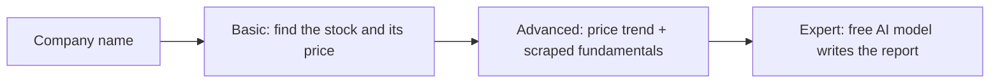

# Project 1 — Stock Market Analyzer (built with GitHub Copilot)

You don't write this code by hand. In VS Code you give **GitHub Copilot** (an AI coding
assistant) a clear prompt. Copilot writes the Python script, runs it in the terminal,
and fixes its own errors. Your job is the part companies care about now: **give clear
instructions, then check that the result is right.**

Each level adds one new idea on top of the last one:

| Level | You type | The script does | New idea |
| ----- | -------- | --------------- | -------- |
| [**Basic**](basic/README.md) | `Infosys` | Finds the company's stock and prints its price, day change, 52-week range, market cap | Talking to a data source (yfinance) |
| [**Advanced**](advanced/README.md) | `Infosys` | Prints the **full trend**: 1 week → 1 year price change, 50/200-day averages, plus fundamentals **web-scraped** from screener.in (growth, ratios, quarterly results, pros/cons) | Web scraping (requests + BeautifulSoup) |
| [**Expert**](expert/README.md) | `Infosys` | Sends all that data to a **free AI model** (Google Gemini, or Groq), which writes a plain-English report | Using AI from your own code |

## What you need

| Level | Python 3.11+ | VS Code + GitHub Copilot | Free AI API key |
| ----- | :----------: | :----------------------: | :-------------: |
| Basic | ✅ | ✅ | — |
| Advanced | ✅ | ✅ | — |
| Expert | ✅ | ✅ | ✅ (Gemini or Groq, no card) |

Setup guides: [Python](../00-prerequisites/python-setup.md) ·
[GitHub, VS Code, Git and Copilot](../00-prerequisites/git-and-editor.md) ·
[Free AI API key](../00-prerequisites/free-ai-api-key.md).
**No AWS account and no credit card needed.**

## How every level works

1. **One folder for the whole project.** Create a folder such as `C:\stock-project`,
   then in VS Code choose **File → Open Folder** and open it. All three scripts live
   there, because each level reuses the one before it.
2. **Open Copilot Chat in Agent mode.** Open the Chat panel (Copilot icon in the title
   bar, or **View → Chat**) and set the mode drop-down to **Agent**.
3. **Copy the prompt** from the level's README into the chat and press Enter.
4. **Let Copilot work.** It writes the file, then asks to run commands such as
   `pip install yfinance` and `python company_info.py "Infosys"`. Read each command,
   then click **Continue/Allow**.
5. **Check the output yourself.** Each README shows what correct output looks like. If
   something is wrong, tell Copilot exactly what you see ("the market cap is missing",
   "it picked the US listing, I want NSE") and let it fix the code.
6. **Stuck?** Each level has a working **reference solution** in this folder
   (`basic/company_info.py`, `advanced/stock_trend.py`, `expert/ai_stock_report.py`).
   Compare it with Copilot's code, or run it directly.

> **Copilot limits:** Copilot Free gives 50 chat requests a month. These three prompts
> plus a few follow-ups use well under that, so don't spend requests on small talk.
> Verified students get more through the Copilot Student plan (GitHub Education).

## Done when

- **Basic:** `python company_info.py "Infosys"` prints a clean block of stock details.
- **Advanced:** `python stock_trend.py "Infosys"` prints the price trend and the scraped
  fundamentals, and saves `INFY_NS_trend.json`.
- **Expert:** `python ai_stock_report.py "Infosys"` prints an AI-written report and
  saves `INFY_NS_report.md`.

**Bonus: put it on GitHub.** First ask Copilot: *"Create a .gitignore that ignores .env,
\*_trend.json, \*_report.md and \_\_pycache\_\_, and a short README.md explaining how to run
the three scripts."* Then use VS Code's **Source Control** panel → **Publish to GitHub**.
Before you confirm, check that `.env` is **not** in the list of files: it holds your key.
A public repo with a clear README is the "clean GitHub" item employers look for.

New to a term? See the [`GLOSSARY.md`](../GLOSSARY.md). Something broken? See
[`TROUBLESHOOTING.md`](../TROUBLESHOOTING.md) and the error table in each level.

> This project is a coding exercise with live market data. Nothing it prints is
> investment advice.
