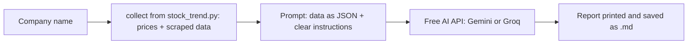

# Project 1 — Expert: an AI-written stock report, with a free AI API

## What you'll build

`ai_stock_report.py`: you type a company name. The script collects the full trend from
the advanced level, sends it to a **free AI model** (Google **Gemini** by default, or
**Groq**), and prints a short plain-English report: what the company does, the price
trend, business health, things to watch, and a one-line summary. The report is saved
as `<SYMBOL>_report.md`.



**Copilot vs. this AI:** GitHub Copilot helps you *write* the script. When the script
runs, it calls an AI model on its own over the internet, using an **API key**. That key
is free too, with no credit card.

## Before you start

- The [advanced level](../advanced/README.md) done, in the same VS Code folder
  (`stock_trend.py` must be there).
- A free **Gemini API key** (or Groq) in a `.env` file in your project folder: see
  [`free-ai-api-key.md`](../../00-prerequisites/free-ai-api-key.md). Your `.env` looks like:

  ```text
  LLM_PROVIDER=gemini
  GEMINI_API_KEY=AIza...your key...
  ```

## Step 1 — Give Copilot this prompt (Agent mode)

```text
Create a Python 3 script called ai_stock_report.py in this folder. It uses collect()
from stock_trend.py to get a company's data, then asks a free AI model to write a report.

Install: pip install openai python-dotenv

Requirements:
1. Load settings from a .env file with python-dotenv: LLM_PROVIDER ("gemini" by default,
   or "groq"), GEMINI_API_KEY, GROQ_API_KEY and an optional LLM_MODEL. Never print or
   hard-code a key.
2. Use the openai library for both providers; they are OpenAI-compatible:
   - gemini: base_url "https://generativelanguage.googleapis.com/v1beta/openai/",
     key GEMINI_API_KEY, default model "gemini-flash-latest"
   - groq: base_url "https://api.groq.com/openai/v1", key GROQ_API_KEY,
     default model "openai/gpt-oss-20b"
3. Read the company name from the command line, or ask with input().
4. Get the data with data = collect(company_name) from stock_trend.py.
5. Build a prompt that gives the model the data as JSON and asks for a short report in
   simple English with 5 sections: Company in one line; Recent price trend; Business
   health (growth, P/E, ROE, pros and cons); Things to watch; One-line summary.
   Tell the model to use only numbers from the data, to say "not available" when
   something is missing, to explain finance words, never to say buy or sell, to keep
   it under 350 words, and to end with "This is a learning exercise, not financial advice."
6. Call client.chat.completions.create(model=..., messages=[...], temperature=0.3) and
   print the answer. If the model name is not found (error 404), list the provider's
   models with client.models.list(), pick one whose name contains "flash" (Gemini) or
   "gpt-oss" (Groq), tell me, and retry.
7. Save the report to <SYMBOL>_report.md and print the model used and the token counts
   from the response's usage.
8. Add a --dry-run option that only prints the prompt, without calling the AI.
9. Catch errors and print a helpful one-line hint: missing key (add it to .env), invalid
   key (Gemini says 400 "valid API key", Groq says 401), 429 (free limit reached: wait a
   minute or switch LLM_PROVIDER), and no internet.

Then run it with --dry-run for "Infosys". If my .env is set up, run it for real.
```

## Step 2 — Run it

First a dry run. It shows exactly what will be sent to the AI, and needs no key:

```bash
python ai_stock_report.py "Infosys" --dry-run
```

Then the real thing:

```bash
python ai_stock_report.py "Infosys"
```

Try the backup too: change `LLM_PROVIDER=groq` in `.env` (with a `GROQ_API_KEY`) and
run again. Same code, different AI. Compare the two reports.

## What correct output looks like

The AI's words are different every time. Check the **shape** and the **facts**:

- Five sections, in this order: *Company in one line*, *Recent price trend*,
  *Business health*, *Things to watch*, *One-line summary*.
- The numbers it quotes (1-year change, P/E, ROE, quarterly sales) match the
  `INFY_NS_trend.json` the advanced level saved. **Pick two numbers and check them.**
  This is the "check the AI's work" skill.
- No "buy" or "sell" advice, and the last line is the learning-exercise disclaimer.
- A last line like `Saved: INFY_NS_report.md   (model: gemini-flash-latest, tokens in/out: 1100/450)`.

If the AI quotes a number that is **not** in the data, that's a hallucination. Note it
and tighten the prompt ("If a number is not in the data, write not available").

## If Copilot's script is wrong — follow-up prompts

- *"Run it with --dry-run and show me the prompt. Send only the fields the report needs, not the whole JSON."*
- *"I get a 404 model not found. List the models from the provider and pick a current flash model."*
- *"The report invents numbers. Add a rule: if a value isn't in the data, write not available."*
- *"Add a --compare option that asks both Gemini and Groq and prints both reports."*

Reference solution: [`ai_stock_report.py`](ai_stock_report.py). In this repo it imports
`stock_trend.py` from `../advanced/`; in your own folder all three files sit together.

## Common errors and fixes

| You see | Fix |
| ------- | --- |
| `GEMINI_API_KEY is not set` | `.env` is missing, named `.env.txt`, or not in the folder you run the script from. |
| `400 ... Please pass a valid API key` (Gemini) / `401 Invalid API Key` (Groq) | Copy the key again into `.env`, with no quotes and no spaces. |
| `429` / quota exceeded | Free limit reached. Wait a minute, or switch `LLM_PROVIDER` to the other service. |
| `404` / model not found | The script picks a current model automatically; if it still fails, delete any `LLM_MODEL=` line. |
| `413` / request too large (Groq) | Groq's free limit is 8,000 tokens per minute. Use Gemini, or send fewer fields (`--dry-run` shows the size). |
| `ModuleNotFoundError: No module named 'stock_trend'` | Run the script from the folder that contains `stock_trend.py`. |
| `No module named 'openai'` | `pip install openai python-dotenv`. |
| Certificate / SSL error | Campus or office HTTPS inspection. Use a phone hotspot, or `pip install truststore` and add `import truststore; truststore.inject_into_ssl()` at the top. |
