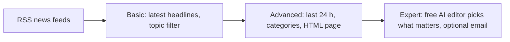

# Project 2 — Morning News Digest (built with GitHub Copilot)

Your own morning news briefing, built in three passes. Like Project 1, you don't type the
code: in VS Code you give **GitHub Copilot** (Agent mode) a clear prompt, it writes and
runs the script, and you check the result.

| Level | You run | The script does | New idea |
| ----- | ------- | --------------- | -------- |
| [**Basic**](basic/README.md) | `news_digest.py cricket` | Top 10 latest headlines from Indian and world news feeds, optionally only about a topic you type | Reading **RSS feeds** |
| [**Advanced**](advanced/README.md) | `news_report.py --open` | Last 24 hours from 8 feeds, sorted into India / World / Business / Tech / Sports, saved as a clean **HTML news page** | Rules for sorting + making a web page |
| [**Expert**](expert/README.md) | `ai_news_briefing.py` | A **free AI model** acts as editor: the 5 most important stories with "why it matters", plus a note for engineering students; optional **email** | AI judgment instead of keyword rules |

**RSS** is a list of a site's latest stories that the site publishes in a fixed format,
just so programs can read it. That's why it doesn't break when the website is redesigned.

## What you need

| Level | Python 3.11+ | VS Code + GitHub Copilot | Free AI API key |
| ----- | :----------: | :----------------------: | :-------------: |
| Basic | ✅ | ✅ | — |
| Advanced | ✅ | ✅ | — |
| Expert | ✅ | ✅ | ✅ (the same Gemini/Groq key as Project 1) |

Setup guides: [Python](../00-prerequisites/python-setup.md) ·
[GitHub, VS Code, Git and Copilot](../00-prerequisites/git-and-editor.md) ·
[Free AI API key](../00-prerequisites/free-ai-api-key.md).
**No credit card needed.** Email delivery (optional) uses a Gmail App Password.

## How every level works

1. Create a folder such as `C:\news-project` and open it in VS Code (**File → Open Folder**).
   All three scripts live there, because each level reuses the one before.
2. Open **Copilot Chat** and set the mode to **Agent**.
3. Paste the prompt from the level's README and press Enter.
4. Copilot writes the file and asks to run `pip install ...` and the script. Read each
   command, then click **Allow**.
5. Check the output against a real news site. If something's wrong, tell Copilot what you
   see and let it fix it.
6. Stuck? Each level has a working **reference solution** in this folder
   (`basic/news_digest.py`, `advanced/news_report.py`, `expert/ai_news_briefing.py`).

## Done when

- **Basic:** `python news_digest.py cricket` prints the latest cricket headlines with source, time and link.
- **Advanced:** `python news_report.py --open` opens a categorised news page in your browser.
- **Expert:** `python ai_news_briefing.py` prints an AI-edited briefing and saves `briefing.md`
  (bonus: `--email` sends it to your inbox).

New to a term? See the [`GLOSSARY.md`](../GLOSSARY.md). Something broken? See
[`TROUBLESHOOTING.md`](../TROUBLESHOOTING.md) and the error table in each level.
