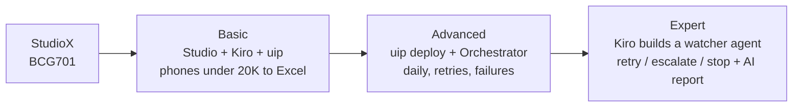

# Project 3 — From StudioX to Agentic RPA (Kiro + UiPath)

You already know **StudioX** from BCG701. This project climbs the rest of the automation
ladder with one real bot, **PhoneDeals**: it lists every smartphone under ₹20,000 from
amazon.in into Excel. Each level makes the same bot more professional, then puts an AI
agent in charge of watching it.

| Tool | What it is | Used for |
| ---- | ---------- | -------- |
| **UiPath Studio** | The professional UiPath designer (StudioX's big brother) | Building the bot |
| **UiPath CLI** (`uip`) | UiPath's official command line | Running, checking, packing, deploying and starting the bot from a terminal, so an AI agent can do it too |
| **Kiro** | An AI agent IDE that works from a written plan (a *spec*) | Writing the spec, explaining each step, writing scripts, running and checking the bot, and building the watcher agent |

## The three levels

### Basic — [`basic/README.md`](basic/README.md)

Kiro writes the **spec** for the PhoneDeals bot. You build it in **UiPath Studio**: open the
amazon.in search, extract the results table, keep phones under ₹20,000, sort them, write
`PhonesUnder20K.xlsx`. Kiro writes `check_phones.py`, then runs the bot with
`uip rpa run-file` and checks the Excel file. **Done** when the checker prints PASSED.

### Advanced — [`advanced/README.md`](advanced/README.md)

Run it like a company: arguments, a **Retry Scope**, clear business vs application
exceptions, and a dated price-history sheet. Kiro writes `deploy.ps1`, which uses the UiPath
CLI to **analyze, pack and deploy** the bot to **Orchestrator**. You start it with
`uip or jobs start`, schedule it daily at 09:00, and **break it on purpose**. **Done** when
it runs from Orchestrator and you have saved your failed jobs.

### Expert — [`expert/README.md`](expert/README.md)

Kiro builds a **watcher agent** from a spec. It reads the bot's jobs and decides **retry,
escalate or stop** for each one (never retrying a CAPTCHA). With your OK, it reruns jobs
through the UiPath CLI, and a free AI model writes the morning report. Finally, you connect
Kiro to UiPath through the CLI's **MCP server**. **Done** when the watcher's decisions on
your real jobs are right and tested.

## Before you start

- Set up **UiPath Studio** (with the browser extension), the **UiPath CLI** and **Kiro**:
  see the Project 3 part of [`00-prerequisites/README.md`](../00-prerequisites/README.md).
- Read the **rules of the road** in the [basic README](basic/README.md#rules-of-the-road-read-this-first):
  one polite search per run, no login, and the bot stops on a robot check. If amazon.in
  blocks you, every level works on the practice shop at
  [webscraper.io/test-sites](https://webscraper.io/test-sites/e-commerce/allinone/phones/touch).
- Kiro's free tier (50 credits a month) covers all three levels: about 6 prompts each.

## Reference files in this folder

| Path | What it is |
| ---- | ---------- |
| [`basic/kiro-specs/phone-deals/`](basic/kiro-specs/phone-deals/requirements.md) | Reference spec: requirements, design, tasks |
| [`basic/check_phones.py`](basic/check_phones.py) | Checks `PhonesUnder20K.xlsx` |
| [`expert/kiro-specs/watcher-agent.spec.md`](expert/kiro-specs/watcher-agent.spec.md) | The watcher agent's spec |
| [`expert/watcher_agent.py`](expert/watcher_agent.py), [`expert/test_watcher_agent.py`](expert/test_watcher_agent.py) | Reference watcher and its tests |
| [`expert/sample_orchestrator_log.json`](expert/sample_orchestrator_log.json) | Five sample PhoneDeals jobs, for working without Orchestrator |
| [`examples/`](examples/README.md) | Finished third-party UiPath projects to study |

There is no reference `Main.xaml` for the bot: Amazon's page changes often, so you build
the extraction live with Studio's Table Extraction wizard.

New to a term? See [`GLOSSARY.md`](../GLOSSARY.md). Stuck? See
[`TROUBLESHOOTING.md`](../TROUBLESHOOTING.md).
