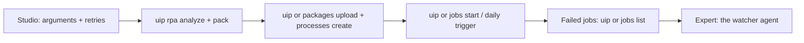

# Project 3 — Advanced: run PhoneDeals like a company

## What you'll build

Your basic bot runs when *you* press Run. A company bot runs **on a schedule, unattended**,
is **deployed by script**, **retries** small glitches, and **fails loudly** on real
problems. You will:

1. Make the bot **reusable** (arguments) and **robust** (retries, clear exceptions),
   and keep a **daily price history**.
2. Use the **UiPath CLI** to check, pack and deploy it to **Orchestrator** with one script
   that Kiro writes.
3. Start it from the terminal, then **schedule** it for every morning.
4. **Break it on purpose** and read the failed jobs: the input for the expert level.



Time: about **75 minutes**. Kiro free tier: about **5 prompts**.

## Prerequisites

- A finished [basic level](../basic/README.md): `python check_phones.py` prints PASSED.
- The UiPath CLI installed and logged in: `uip login status` shows your tenant —
  [`00-prerequisites/uipath-cli.md`](../../00-prerequisites/uipath-cli.md)
- Orchestrator in your free Community account (included) —
  [`00-prerequisites/uipath-cloud.md`](../../00-prerequisites/uipath-cloud.md)
- The same rules of the road as the basic level: one search page per run, stop on a robot
  check. **A daily schedule is the most you should run against amazon.in**; for testing
  many runs in a row, point the bot at the practice site.

---

## Step-by-step setup

### Step 1 — Kiro updates the spec

**Prompt A1 (Kiro, Spec mode, on the existing "phone-deals" spec)**

```text
Update the phone-deals spec for production use:
1. Arguments: in_SearchTerm (String, default "smartphone"), in_MaxPrice (Int32, default
   20000), out_PhoneCount (Int32). Build the URL from them:
   "https://www.amazon.in/s?k=" + in_SearchTerm + "&rh=p_36%3A-" + (in_MaxPrice * 100).ToString
   and use in_MaxPrice instead of 20000 in the price filter.
2. Retries: wrap opening the page and Extract Table Data in a Retry Scope
   (3 attempts, 5 seconds apart) for slow pages and timeouts.
3. Exceptions: robot check and "no phones found" stay BusinessRuleExceptions (never
   retried). Anything else is an application exception: log it and let the job fail.
4. History: besides sheet "Phones", also write today's list to a sheet named with the
   date, Now.ToString("yyyy-MM-dd"), so the workbook builds a daily price history.
Add the new requirements, update design.md, and add the new tasks to tasks.md.
```

Then build the new tasks in Studio, asking Kiro to explain each one as in the basic level:

**Prompt A2 (Kiro, Vibe mode)**

```text
Explain the new tasks in .kiro/specs/phone-deals/tasks.md one at a time for UiPath Studio:
how to create the arguments in the Arguments panel, where the Retry Scope goes and what to
put in its Condition, and how to write the dated sheet. Give exact property values.
```

| Change in Studio | How |
| ---------------- | --- |
| Arguments | **Arguments** panel: `in_SearchTerm` (In, String, default `"smartphone"`), `in_MaxPrice` (In, Int32, default `20000`), `out_PhoneCount` (Out, Int32) |
| URL from arguments | Use Application/Browser → Browser URL: `"https://www.amazon.in/s?k=" + in_SearchTerm + "&rh=p_36%3A-" + (in_MaxPrice * 100).ToString` |
| Retries | **Retry Scope** (Number of retries `3`, Retry interval `00:00:05`) around the extraction |
| Filter | `price <= in_MaxPrice` instead of `price <= 20000` |
| History sheet | A second **Write DataTable to Excel** to `Excel.Sheet(Now.ToString("yyyy-MM-dd"))` |
| Output | **Assign** `out_PhoneCount = dtPhones.Rows.Count` |

Test locally with a different limit:

```powershell
uip rpa run-file --file-path C:\PhoneDeals\Main.xaml --input-arguments '{"in_MaxPrice": 15000}'
python check_phones.py --max 15000
```

### Step 2 — Check and pack with the UiPath CLI

```powershell
cd C:\PhoneDeals
uip rpa analyze --help          # see the options on your version first
uip rpa analyze .               # Workflow Analyzer: the same rules Studio uses
uip rpa pack . --output .\dist  # builds dist\PhoneDeals.<version>.nupkg
```

Fix every **error** the analyzer reports (warnings are advice). Ask Kiro:
*"Explain these Workflow Analyzer messages and how to fix each one in Studio."*

### Step 3 — Kiro writes the deploy script

**Prompt A3 (Kiro, Vibe mode)**

```text
Write deploy.ps1 for this UiPath project using the UiPath CLI (uip). First run
"uip rpa pack --help", "uip or packages upload --help" and "uip or processes create --help"
to see the exact options on my installed version. The script must:
1. stop if "uip login status" shows I am not logged in;
2. run uip rpa analyze . and stop on errors;
3. run uip rpa pack . --output .\dist and find the newest .nupkg;
4. upload it with uip or packages upload;
5. create the process "PhoneDeals" in folder "Shared" with entry point Main.xaml
   (uip or processes create), or update it if it already exists;
6. print the process key from uip or processes list --folder-path Shared.
Print each step before running it. No passwords or secrets in the file.
```

Run it: `.\deploy.ps1`. In Orchestrator (**cloud.uipath.com → Orchestrator → Shared →
Automations → Processes**) you now see **PhoneDeals**.

The commands it uses (from the UiPath CLI docs):

```powershell
uip or packages upload .\dist\PhoneDeals.1.0.2.nupkg
uip or processes create --name "PhoneDeals" --package-key "PhoneDeals" --package-version "1.0.2" --folder-path "Shared" --entry-point "Main.xaml"
uip or processes list --folder-path "Shared"
```

> **Optional, Kiro agent hook:** ask Kiro *"Create an agent hook that runs
> `uip rpa analyze .` every time I save Main.xaml and tells me about new errors."*
> Hooks live in `.kiro/hooks/`. Now every save gets an automatic review.

### Step 4 — Run it from Orchestrator, then schedule it

1. **Connect your laptop as a robot** (one time). In Orchestrator: **Tenant → Machines**,
   add a machine template for your laptop with **1 unattended runtime**, and copy its
   **machine key**. In **UiPath Assistant** → **Preferences → Orchestrator Settings**,
   connect with the key. Then give your user an **unattended robot** with your Windows
   login. The screens change between versions: search *"unattended robot setup"* on
   [docs.uipath.com](https://docs.uipath.com/), or ask your instructor.
2. **Start a job from the terminal** (process key from Step 3):

   ```powershell
   uip or jobs start <process-key> --input-arguments '{"in_MaxPrice": 20000}' --wait-for-completion --timeout 600
   ```

   It waits and prints **Successful** or **Faulted**. Your laptop must be on.
3. **Schedule it**: Orchestrator → **Shared → Automations → Triggers → Add trigger →
   Time trigger**: process PhoneDeals, **every day at 09:00**, your time zone. One run a
   day, never more often.

### Step 5 — Break it on purpose (two ways)

| Break it | What should happen | Why it matters |
| -------- | ------------------ | -------------- |
| Start a job with `--input-arguments '{"in_SearchTerm": "zzqqxxphone"}'` | **Faulted** with "No phones found under Rs 20,000." — a business exception, **not retried** | Bad input never fixes itself |
| Open `PhonesUnder20K.xlsx` in Excel on the robot's PC, then start a job | The Excel step fails ("file in use") — an application exception | A short glitch: worth a retry once the file is closed |

See the failed jobs and save them for the expert level:

```powershell
uip or jobs list --folder-path "Shared" --state Faulted --process-name "PhoneDeals"
uip or jobs list --folder-path "Shared" --process-name "PhoneDeals" --limit 10 --all-fields > my_jobs.json
```

**Prompt A4 (Kiro, Vibe mode)**

```text
Read my_jobs.json. For each PhoneDeals job, tell me the state, the error, and whether it
was a business exception or an application exception. Which ones would be worth retrying?
```

Kiro is already doing what the expert-level watcher will do automatically.

## Done when

- `.\deploy.ps1` packs and deploys PhoneDeals to Orchestrator without errors.
- `uip or jobs start <key> --wait-for-completion` ends **Successful**, and the Excel file
  has a dated history sheet.
- A daily 09:00 trigger exists.
- You have at least one **Faulted** job of each kind, saved in `my_jobs.json`.

## Common errors and fixes

| You see | Fix |
| ------- | --- |
| `uip login status` says not logged in | `uip login --interactive`, pick your tenant. Tokens expire: log in again after a break. |
| `uip rpa pack` fails on a missing package | Open the project in Studio once so it restores dependencies, save, then pack again. |
| `packages upload` says the version already exists | Each upload needs a new version. Add a version option to pack (see `uip rpa pack --help`) or let Studio bump it, then pack again. |
| Robot shows **Unavailable** / job stays **Pending** | The laptop isn't connected: check UiPath Assistant is signed in with the machine key, and the unattended robot has your Windows login. |
| Job fails: "could not log in" | Unattended robots log in with the Windows credentials you stored. Fix them in Orchestrator, or run attended with `uip rpa run-file` for the demo. |
| Trigger never fires | It's disabled, or set in another time zone. Orchestrator uses the tenant time zone. |
| Everything retries forever | You retried a business exception. Robot check and "no phones" must be BusinessRuleExceptions **outside** the Retry Scope. |
