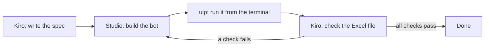

# Project 3 — Basic: the PhoneDeals bot (phones under ₹20,000 → Excel)

## What you'll build

A UiPath bot that opens **amazon.in**, searches for smartphones, reads the first page of
results, keeps every phone **under ₹20,000**, sorts them cheapest first, and writes them
to an Excel file, `PhonesUnder20K.xlsx`.

You use three tools together, the way automation teams work in 2026:

| Tool | Its job in this level |
| ---- | --------------------- |
| **Kiro** (AI agent IDE) | Writes the plan (a *spec*), explains each Studio step, writes the checker script, runs the bot and checks the result for you |
| **UiPath Studio** | Where you build the bot: browser, table extraction, filter, Excel |
| **UiPath CLI** (`uip`) | Runs the bot from the terminal, so Kiro can run and test it |



Time: about **75 minutes**. Kiro free tier: about **6 prompts** (50 credits a month is plenty).

## Prerequisites

- **UiPath Studio** (Community, free) installed, signed in, with the **browser extension**
  for Chrome or Edge — [`00-prerequisites/uipath-cloud.md`](../../00-prerequisites/uipath-cloud.md)
- **Kiro** installed and signed in — [`00-prerequisites/kiro-install.md`](../../00-prerequisites/kiro-install.md)
- **UiPath CLI** (`uip`) installed and logged in — [`00-prerequisites/uipath-cli.md`](../../00-prerequisites/uipath-cli.md)
- **Python 3.11+** with `openpyxl` (`pip install openpyxl`, or the full
  [`requirements.txt`](../../00-prerequisites/requirements.txt))
- Desktop **Excel** is *not* required: the bot writes the file itself.

## Rules of the road (read this first)

Amazon is a real shop, not a practice site. Its Conditions of Use do not allow robots or
data mining, and it blocks bots that behave badly. In this lab you build a **small,
polite, attended** bot for **learning only**:

- **One search, one page**, started by you. No looping over pages, no scheduling every
  few minutes.
- **No login**, no cart, no checkout, no personal data.
- **If Amazon shows a robot check (CAPTCHA), the bot stops.** Never try to get around it.
  Wait, try later, or switch to the practice site below.
- Keep the Excel file for your own learning. Don't publish or sell the data.

> **Practice site (no rules to worry about):** if Amazon blocks you, or your instructor
> prefers, use <https://webscraper.io/test-sites/e-commerce/allinone/phones/touch>, a
> shop built for scraping practice. Prices there are in US dollars, so use a limit of
> **500** instead of 20,000. Every step below works the same.

---

## Step-by-step setup

### Step 0 — One folder for everything

1. Create the folder `C:\PhoneDeals`.
2. Open it in **Kiro**: **File → Open Folder → C:\PhoneDeals**.
3. Teach Kiro about this project with a **steering file**. Create
   `C:\PhoneDeals\.kiro\steering\uipath.md` and paste this in:

   ```markdown
   # Project rules for Kiro
   - This folder is a UiPath Studio 2026 project called PhoneDeals: Windows, VB.NET expressions.
   - Use only modern UiPath activities (Use Application/Browser, Extract Table Data,
     Build Data Table, For Each Row in Data Table, Add Data Row, Sort Data Table,
     Use Excel File, Write DataTable to Excel). If you are not sure an activity or
     property exists, say so instead of guessing.
   - Explain Studio steps for a beginner: which activity, where to drag it, which property to set.
   - The bot is small and polite: one amazon.in search page, started by a person, no login.
     If the site shows a robot check (CAPTCHA) the bot must stop. Never suggest bypassing it.
   - Run workflows with: uip rpa run-file --file-path C:\PhoneDeals\Main.xaml
   - Check the output with: python check_phones.py
   - Never put passwords, keys or secrets in files or in chat.
   ```

   Kiro reads every file in `.kiro/steering/` before it answers, so you don't repeat
   these rules in each prompt.

### Step 1 — Kiro writes the spec

Open the **Kiro** panel, choose **Spec** (not Vibe), and paste:

**Prompt 1 (Kiro, Spec mode)**

```text
Create a spec called "phone-deals" for a UiPath Studio bot.
Goal: list every smartphone under Rs 20,000 from the first page of amazon.in search
results and save them in an Excel file.
Details:
- Open this URL in the browser: https://www.amazon.in/s?k=smartphone&rh=p_36%3A-2000000
  (Amazon's own "up to Rs 20,000" price filter).
- Extract from each result: phone name, price, rating.
- Clean the price text ("₹9,499" -> 9499) and keep only phones with price <= 20000,
  because sponsored results can ignore the filter.
- Remove duplicates, sort by price (cheapest first).
- Write to PhonesUnder20K.xlsx, sheet "Phones", columns Name, Price, Rating.
- If the page shows a robot check (CAPTCHA) or no results, stop with a clear message.
- Only the first page. No login.
Write requirements with acceptance criteria, a design that names the UiPath activities
and variables, and small numbered tasks I can follow in Studio.
```

Kiro writes three files in `.kiro/specs/phone-deals/`: **requirements.md**,
**design.md** and **tasks.md**. Read them. If something is wrong (for example a made-up
activity name), tell Kiro in plain words and let it fix the spec. Your reference copy is in
[`kiro-specs/phone-deals/`](kiro-specs/phone-deals/requirements.md).

### Step 2 — Create the project in Studio

1. Open **UiPath Studio** → **New Project → Process**.
   Name: `PhoneDeals`. Location: `C:\` (so the project lands in `C:\PhoneDeals`).
   Compatibility: **Windows**. Language: **VB**.
2. **Manage Packages**: make sure **UiPath.UIAutomation.Activities** and
   **UiPath.Excel.Activities** are installed.
3. In your browser (Chrome or Edge), open the search URL from Prompt 1 once by hand.
   Check you see phones with prices. Leave the tab open.

### Step 3 — Build the bot (Kiro explains, you click)

For each task in `tasks.md`, ask Kiro to walk you through it:

**Prompt 2 (Kiro, Vibe mode — use it for each task)**

```text
Explain task 1 from .kiro/specs/phone-deals/tasks.md step by step for UiPath Studio:
which activity to drag in, where to put it, and the exact property values and VB
expressions to type. I am a beginner who knows StudioX.
```

Change "task 1" to the next task each time. Your finished `Main.xaml` should follow this
shape:

| # | Activity | Settings |
| - | -------- | -------- |
| 1 | **Use Application/Browser** | Indicate the Amazon tab. **Browser URL**: the search URL. Everything below goes **inside** it. |
| 2 | **Check App State** *(robot check)* | Target: the text "Type the characters you see" on a CAPTCHA page. If it appears: **Throw** `New BusinessRuleException("Amazon showed a robot check. Stopping.")` |
| 3 | **Extract Table Data** | Opens the **Table Extraction** wizard: click the first phone's **name**, let it find the others, then add columns for **price** (the big number) and **rating**. Name the columns `Name`, `Price`, `Rating`. When asked about more pages, choose **No** (one page only). Output: `dtRaw` |
| 4 | **Build Data Table** | `dtPhones` with columns `Name` (String), `Price` (Int32), `Rating` (String) |
| 5 | **For Each Row in Data Table** (`dtRaw`) | **Assign** `priceText = CurrentRow("Price").ToString.Replace("₹","").Replace(",","").Trim` → **If** `Integer.TryParse(priceText, price) AndAlso price >= 1 AndAlso price <= 20000` → **Add Data Row** to `dtPhones` with ArrayRow `{CurrentRow("Name").ToString.Trim, price, CurrentRow("Rating").ToString}` |
| 6 | **If** `dtPhones.Rows.Count = 0` | **Throw** `New BusinessRuleException("No phones found under Rs 20,000.")` |
| 7 | **Remove Duplicate Rows** → **Sort Data Table** | `dtPhones`, sort by `Price`, **Ascending** |
| 8 | **Use Excel File** | File: `PhonesUnder20K.xlsx`, tick **Create if not exists**. Inside: **Write DataTable to Excel**, what to write `dtPhones`, destination `Excel.Sheet("Phones")`, **include headers** |
| 9 | **Log Message** | `dtPhones.Rows.Count.ToString + " phones under Rs 20,000 saved"` |

Variables: `dtRaw`, `dtPhones` (DataTable), `priceText` (String), `price` (Int32).

Press **Run (F5)** in Studio once. Open `PhonesUnder20K.xlsx` and look at it yourself.

> **Kiro as a reviewer:** after building, ask: *"Read Main.xaml and compare it with
> tasks.md. List anything missing or different."* Kiro can read the XAML file even
> though you built it in Studio.

### Step 4 — Kiro writes the checker

**Prompt 3 (Kiro, Vibe mode)**

```text
Write check_phones.py in this folder. It opens PhonesUnder20K.xlsx, sheet "Phones",
and checks: Name and Price columns exist; at least one phone; every price is a whole
number from 1 to 20000 (accept 9499, "9,499" or "₹9,499"); no empty names; no
duplicate names; sorted by price, cheapest first. Print PASSED or FAILED with each
problem and its row number, and exit with code 1 on failure. Use openpyxl. Then run it.
```

Reference solution: [`check_phones.py`](check_phones.py).

### Step 5 — Kiro runs the bot with the UiPath CLI and checks it

Close the Excel file first (an open file is locked). Then:

**Prompt 4 (Kiro, Vibe mode)**

```text
Run the bot from the terminal with:
  uip rpa run-file --file-path C:\PhoneDeals\Main.xaml
Wait for it to finish, then run: python check_phones.py
If the run fails or any check fails, explain which step of Main.xaml is the cause and
how to fix it in Studio. If all checks pass, tell me how many phones were found and the
cheapest one.
```

Kiro asks before running each command: read it, then allow it. This is the **agent loop**
from the talk: Kiro **looks** (reads the output), **thinks** (finds the cause),
**acts** (runs the bot) and **checks** (runs the checker).

### Expected result

```text
Checking PhonesUnder20K.xlsx (limit ₹20,000)
  14 phones, cheapest ₹6,999, dearest ₹19,999
PASSED: all checks OK
```

Your numbers will differ: prices change every day.

## Done when

- `uip rpa run-file --file-path C:\PhoneDeals\Main.xaml` finishes without errors.
- `python check_phones.py` prints **PASSED**.
- Kiro's spec (`.kiro/specs/phone-deals/`) matches what you built.

## Common errors and fixes

| You see | Fix |
| ------- | --- |
| The bot can't attach to the browser / "extension not installed" | In Studio: **Home → Tools → Extensions → Chrome** (or Edge), install, then **enable** the extension in the browser. Restart the browser. |
| A robot check (CAPTCHA) page | Stop. Don't bypass it. Wait 30 minutes, try once more, or use the practice site (limit 500). |
| `dtRaw` is empty | Amazon changed the page, or the wizard picked the wrong element. Run **Extract Table Data** again and click a phone **name**, not an ad. |
| Prices like `9,499` fail to parse | The `Replace("₹","").Replace(",","")` part is missing in the Assign, or the price column caught extra text. Re-pick only the big price number. |
| `check_phones.py` says "above the 20,000 limit" | The `If` condition is missing, so sponsored phones slipped in. That is exactly why the bot filters again. |
| "File is used by another process" | `PhonesUnder20K.xlsx` is open in Excel. Close it and run again. |
| `uip` is not recognized / `run-file` can't find Studio | See [`uipath-cli.md`](../../00-prerequisites/uipath-cli.md): open a new terminal; Studio must be installed on this PC. |
| Kiro says it ran out of credits | The free tier gives 50 a month. Use Vibe prompts for small questions, and keep one chat per task. |
